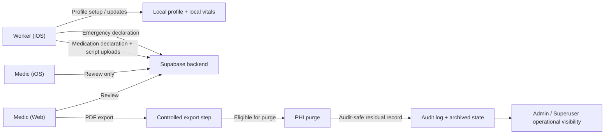

# MedPass Compliance Architecture Note

## Scope

This document describes the current MedPass system architecture from a privacy, governance, and PHI handling perspective.

It is intended for:

- internal engineering and product alignment
- compliance and privacy discussions
- customer due diligence support
- architecture review

This note complements the higher-level product summary in [product-system-permissions.md](/Volumes/1tbusb/MedM8_WebApp/docs/product-system-permissions.md).

## System Objective

MedPass is designed to reduce privacy and governance risk in mining-sector medical declaration workflows by separating:

- worker data entry and field workflows from
- formal export and long-term PHI lifecycle actions

The architecture aims to preserve operational usability while reducing uncontrolled PHI handling on personal or field mobile devices.

## System Components

### 1. iOS application

Primary functions:

- worker sign-in and business join flow
- local medical profile storage
- local vital signs logging
- emergency declaration submission
- confidential medication declaration submission
- worker history and recall flow
- medic review flow
- admin and superuser operational flow

Security and privacy relevance:

- worker PHI originates here
- local PHI is scoped per authenticated user
- shared-device cleanup behavior exists for local profile and vitals data
- export is not provided to medics on iOS

### 2. Web application

Primary functions:

- medic dashboard and review workflows
- declaration and medication declaration PDF export
- post-export PHI purge
- admin operational controls
- superuser platform controls
- feedback and audit interfaces

Security and privacy relevance:

- web is the governed export environment
- purge and archival controls are concentrated here
- superuser workflows are designed around non-PHI metadata

### 3. Supabase backend

Primary functions:

- authentication
- role-based data access
- business and site data
- declaration persistence
- storage for supporting script images
- API routes and privileged server-side actions
- purge audit log persistence

Security and privacy relevance:

- backend is the system of record
- route-level authorization is critical where privileged service-role access exists
- tenant boundaries must be enforced by business and site scope

## Data Classes

### PHI / sensitive health information

Examples in the current system include:

- worker medical profile content
- emergency declaration worker snapshot data
- medication declaration contents
- allergies, conditions, medication lists
- emergency contact details
- script or prescription image references

### Operational metadata

Examples include:

- business identifiers
- site identifiers
- user roles
- review state
- submission timestamps
- reminder intervals
- module enablement flags
- invite codes

### Audit-safe residual data

Examples include:

- submission status
- decision metadata
- export timestamps
- purge timestamps
- business and site references
- actor references stored in audit logs

## Role Model

### Worker

- iOS only
- creates and updates PHI
- submits declarations
- views own history
- may recall a new declaration before review

### Medic

- iOS and web
- reviews PHI within assigned operational scope
- can act on declarations
- web-only export and purge capability

### Admin

- operational management role
- business-scoped to a single customer tenant
- manages sites, invite codes, medic access, submission oversight, and purge accountability
- may search purge history by worker name and date of birth for compliance and dispute resolution
- should not require declaration-body or clinical visibility to perform core duties

### Superuser

- cross-business platform operator
- intended to operate without PHI access wherever possible
- manages business onboarding and system-level controls

## PHI Boundary Model

The product intentionally implements the following boundary:

### Boundary 1: Worker entry boundary

Workers enter PHI through the iOS application.

Rationale:

- mobile is the natural point of interaction for the worker
- declarations can be completed near the operational event
- worker-specific data can be kept within a scoped app environment

### Boundary 2: Review boundary

Medics may review declarations on:

- iOS for field practicality
- web for controlled office workflows

Rationale:

- review needs operational flexibility
- review alone is not treated as equivalent to export

### Boundary 3: Export boundary

PDF export is restricted to the web application.

Rationale:

- avoids exporting PHI from a personal or field mobile device
- centralises the highest-risk output action in a more governable environment

### Boundary 4: Retention boundary

After export, PHI can be purged while leaving an audit-safe residual record.

Rationale:

- reduces the long-term live PHI footprint
- preserves operational traceability
- supports retention minimisation principles

### Boundary 5: Admin oversight boundary

Admins may oversee workflow and audit state only within their own business.

Rationale:

- admins need submission counts and stale-review visibility for safety escalation and billing tracking
- admins need purge-log lookup to resolve disputes about who exported or purged a worker record
- admins do not need declaration contents or clinical payloads to perform those duties

## Data Flow Overview

## Lifecycle Of An Emergency Declaration

1. Worker submits declaration on iOS.
2. Declaration is stored in the backend with PHI content.
3. Medic reviews declaration on iOS or web.
4. Declaration may be approved, moved to follow-up, or recalled before review.
5. If formal export is required, export occurs on the web app.
6. After export, PHI may be purged.
7. Archived record and purge audit trail remain.

## Lifecycle Of A Confidential Medication Declaration

1. Worker submits declaration on iOS when disclosing a new or newly relevant medication.
2. Supporting script images may be uploaded for flagged medications.
3. Medic reviews declaration on iOS or web.
4. Medication review outcome is recorded.
5. As with emergency declarations, export and purge control belong to the web environment, not the iOS medic workflow.

## Shared-Device Privacy Controls

The iOS application includes controls intended for shared or communal device environments:

- local profile storage is keyed to the authenticated user
- a fresh app environment is created per login
- local vital signs storage is also user-scoped
- local data can be cleared on sign-out when the user has not opted to retain it
- explicit purge behavior exists for communal-device scenarios

These controls reduce the risk of one worker accessing another worker's locally stored PHI on the same device.

## Governance Controls Visible In The Current Architecture

### Positive controls

- worker role is isolated to the iOS app
- export is withheld from iOS medic workflows
- post-export purge exists
- archived states are represented after purge
- purge audit logging exists
- superuser workflows are described and implemented as non-PHI-oriented
- role-based site assignment exists for medics
- admin oversight is intended to be business-scoped and operational rather than clinical

### Controls that must remain strict

- route-level tenant scoping for service-role actions
- business-level and site-level authorization checks
- prevention of out-of-scope review, export, or purge
- prevention of mobile export drift
- prevention of admin access to declaration-body data and other clinical PHI
- prevention of cross-business admin visibility

## Known Architectural Differences Between Platforms

The platforms intentionally differ in responsibility.

### Expected differences

- worker workflows are iOS-only
- export and purge are web-only
- mobile supports local PHI and field workflows
- web supports governed back-office operations

### Current differences that should be treated as policy decisions

- admin oversight should be aligned across iOS and web so both platforms expose the same business-scoped operational views
- purge-log identity lookup should remain limited to worker name and date of birth plus the export and purge audit chain

## Residual Risk Areas To Monitor

### 1. Service-role backend operations

Any route or repository layer using elevated backend privileges must enforce tenant scope explicitly.

Required checks should include:

- correct business ownership
- correct site assignment where applicable
- role authorization

### 2. Mobile visibility drift

The current privacy model depends on keeping export and PHI lifecycle controls off the iOS medic experience.

That boundary should remain explicit in product and engineering decisions.

### 3. Admin scope consistency

If admin visibility differs materially between iOS and web, that difference should be treated as a drift from the intended policy.

The intended policy is:

- admins can see business-scoped submission counts, statuses, and site breakdowns
- admins can search purge logs by worker name and date of birth
- admins cannot open declaration contents or read clinical PHI

## Summary

MedPass implements a privacy-oriented split architecture:

- workers use iOS to create and submit PHI-bearing declarations
- medics review on iOS or web
- export and post-export purge are restricted to the web app
- audit-safe information remains after PHI removal
- superuser functions focus on platform operations rather than patient-level data

From a compliance architecture standpoint, the most important design feature is not simply role-based access.

It is the deliberate separation of:

- PHI collection
- PHI review
- PHI export
- PHI retention minimisation

across the two platforms.
